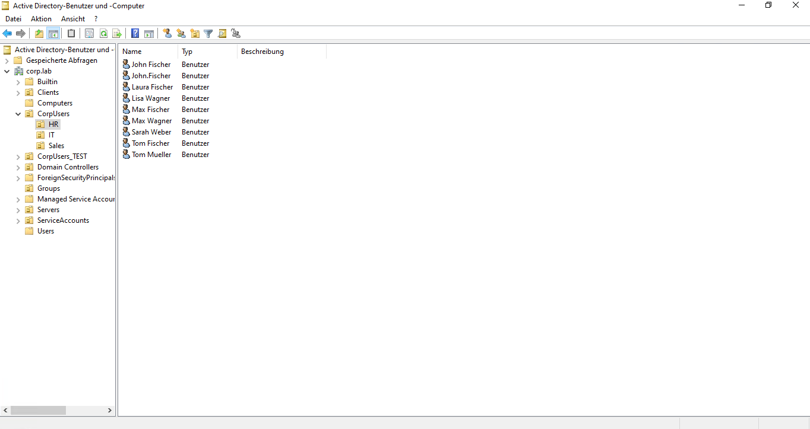
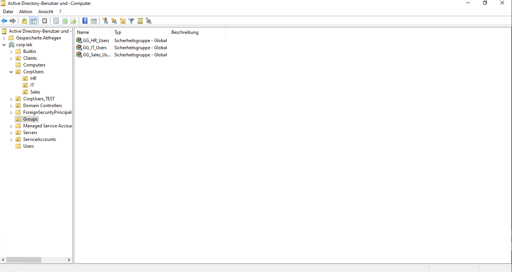
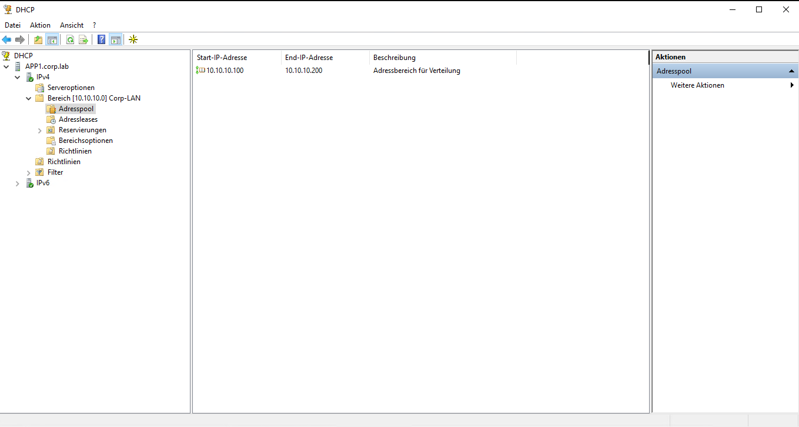
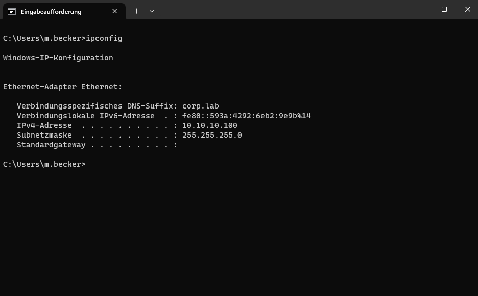
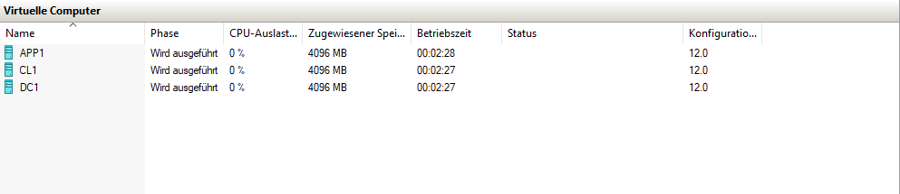

# Active Directory Homelab Automation

## 🚀 Overview

This project demonstrates a self-built Active Directory environment with automated user provisioning and role-based access control.

The lab simulates a small business infrastructure with a Domain Controller, a Management Server, and a Client system.

---

## 🏗️ Architecture

* **DC1** – Domain Controller (AD DS, DNS)
* **APP1** – Management Server (DHCP, Automation)
* **CL1** – Domain Client

---

## ⚙️ Technologies Used

* Active Directory (AD DS)
* DNS
* DHCP
* Windows Server 2022
* Hyper-V
* PowerShell
* Python
* Git & GitHub

---

## 🔧 Features

* Creation of a custom AD domain (`corp.lab`)
* Organizational Unit (OU) structure (IT, HR, Sales)
* Automated user generation (Python)
* Automated user provisioning (PowerShell)
* Group-based access control (RBAC)
* DHCP configuration for dynamic IP assignment
* Separation of infrastructure and management roles
* Basic Group Policy Object (GPO) implementation
* Logging of automation processes

---

## 🌐 Network Services

* DHCP server deployed on a dedicated member server (APP1)
* Configured IP address scope for internal network
* Automatic IP assignment for domain clients
* DNS integration for domain resolution

---

## 🔄 Automation Workflow

1. Python script generates user data (CSV)
2. PowerShell script imports users into Active Directory
3. Users are assigned to security groups
4. Access permissions are applied via groups
5. Logs are generated for traceability

---

## 📊 Monitoring

A custom PowerShell monitoring script checks:

- Domain Controller availability
- DNS resolution
- DHCP service status
- CPU usage
- RAM usage
- Disk space

The script runs automatically using Windows Task Scheduler and logs results to a file.

---

## 🔐 Access Control Concept

* Access is assigned via security groups (not directly to users)
* Example:

  * `GG_IT_Users` → Access to IT share
  * `GG_HR_Users` → Access to HR share
* This ensures scalability and easier management

---

## 📸 Screenshots

### Active Directory Structure

### Groups

### DHCP Configuration

### Client IP Configuration

### Virtual Environment (Hyper-V)

---

## 📁 Project Structure

* `python/` → User data generation
* `powershell/` → AD automation scripts
* `docs/` → Screenshots & documentation
* `.gitignore` → Prevents sensitive/local data upload

---

## 🧠 Key Learnings

* Practical setup and management of Active Directory
* Understanding of domain architecture and services
* DHCP and DNS integration in a Windows environment
* Automation of user lifecycle processes
* Role-based access control (RBAC)
* Separation of infrastructure roles
* Version control using Git and GitHub

---

## 🔒 Notes

* The lab environment is isolated and runs without internet access
* No real user data or credentials are used
